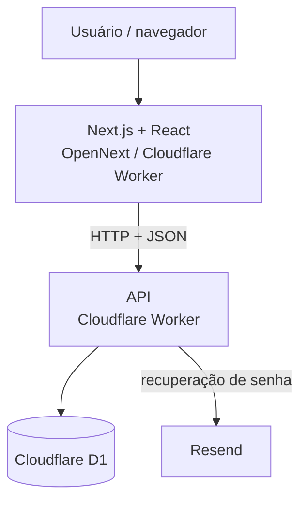
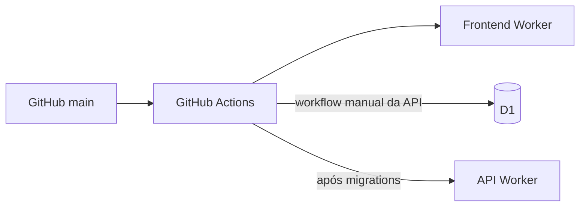

# Arquitetura do Receitando

## Visão geral

A produção atual do Receitando usa **Cloudflare Workers** tanto no frontend quanto na API. O frontend é uma aplicação Next.js compilada com OpenNext; a API é um Worker separado com persistência em Cloudflare D1.



O frontend nunca acessa o banco diretamente. Estado persistente passa pela API.

## Componentes

### Frontend

Diretório: `frontend/`

Responsabilidades principais:

- navegação e layout;
- autenticação no cliente;
- catálogo e detalhes de receitas;
- experiência de matching em `/combinar`;
- despensa e favoritos;
- perfil do usuário;
- recuperação de senha;
- interação social nas receitas;
- estados de loading, erro e 404.

A camada em `frontend/src/services/` concentra as chamadas HTTP para evitar espalhar detalhes da API pelos componentes visuais.

### API

Diretório: `backend/worker-prototype/`

Apesar do nome histórico, esta é a API usada pela arquitetura atual.

O ponto de entrada configurado no Wrangler é `src/home-worker.ts`. A implementação é dividida em Workers encadeados:

```text
home-worker
   ↓
catalog64-worker
   ↓
social-worker
   ↓
profile-worker
   ↓
password-reset-validation-worker
   ↓
password-reset-worker
   ↓
pantry-worker
   ↓
index
```

Cada camada atende um grupo de rotas e encaminha o restante para a próxima.

Áreas principais:

- `home-worker`: feed da home;
- `catalog64-worker`: catálogo eficiente, ingredientes e matching;
- `social-worker`: votos e comentários;
- `profile-worker`: perfil autenticado;
- `password-reset-worker`: recuperação de senha;
- `pantry-worker`: despensa e favoritos;
- `index`: autenticação e rotas-base.

## Persistência

O banco de produção é **Cloudflare D1**.

As migrations ficam em:

```text
backend/worker-prototype/migrations/
```

Elas definem contas, sessões, catálogo, aliases de ingredientes, despensa, favoritos, recuperação de senha, perfis, votos, comentários e metadados de fontes externas.

A API usa SQL preparado diretamente pela API do D1.

## Autenticação

O login cria um token aleatório de sessão. O cliente recebe o token, enquanto o banco armazena somente seu hash.

Requisições autenticadas usam:

```text
Authorization: Bearer <token>
```

Senhas são derivadas com PBKDF2 usando Web Crypto. Recuperações de senha usam códigos temporários e tokens que também são armazenados de forma derivada/hash.

## Matching

O fluxo principal é:


O cálculo principal considera ingredientes obrigatórios:

```text
compatibilidade = encontrados / obrigatórios × 100
```

O motor também usa aliases normalizados para aproximar variações conhecidas de nomes de ingredientes.

## Catálogos externos

O schema suporta proveniência de receitas por meio de campos de origem e identidade externa.

O repositório contém scripts/workflows de importação para fontes públicas usadas em experimentos, incluindo TheMealDB e um dataset CC0 de aproximadamente 64 mil receitas.

Importação de dados é tratada separadamente da experiência principal. Licença e autorização da fonte devem ser verificadas antes de publicar conteúdo de terceiros.

## Deploy e CI



O frontend possui deploy automatizado conforme os caminhos configurados no workflow. A API possui workflow de produção separado que valida o código, aplica migrations remotas e publica o Worker.

Credenciais da Cloudflare e outros valores secretos ficam em GitHub Secrets ou secrets do ambiente, nunca na documentação.

## Desenvolvimento local

| Componente | Endereço padrão |
| --- | --- |
| Frontend | `http://localhost:3000` |
| API Worker | `http://localhost:8787` |
| D1 | banco local gerenciado pelo Wrangler |

A implementação antiga em `backend/` usa NestJS, Prisma e PostgreSQL e é mantida apenas como referência histórica; ela não representa a infraestrutura de produção atual.
