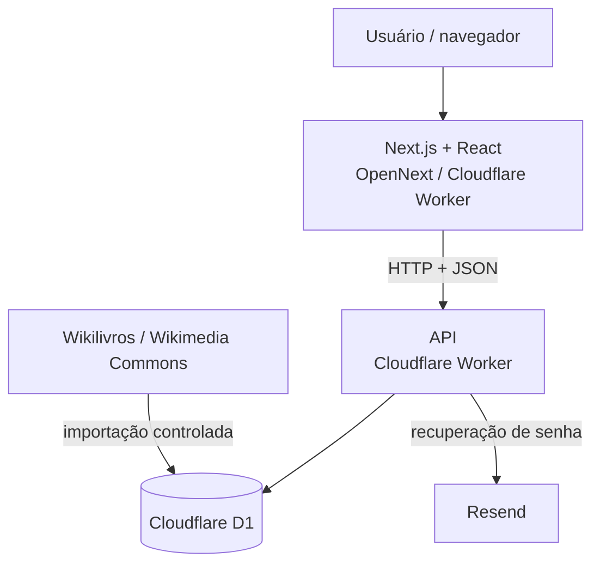
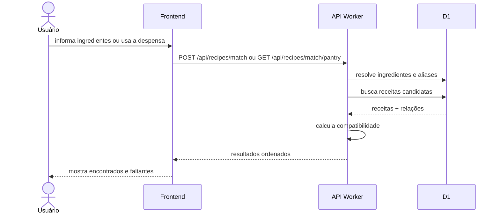
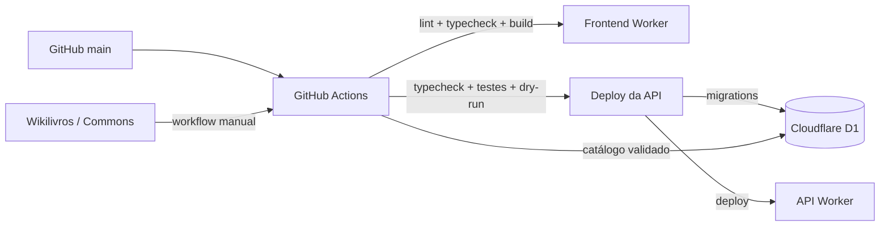

# Arquitetura do Receitando

## Visão geral

A produção atual do Receitando usa **Cloudflare Workers** tanto no frontend quanto na API. O frontend é uma aplicação Next.js compilada com OpenNext; a API é um Worker separado com persistência em Cloudflare D1.



O frontend nunca acessa o banco diretamente. Estado persistente passa pela API. O catálogo externo é importado por scripts/workflows separados da navegação em produção.

## Frontend

Diretório: `frontend/`.

Responsabilidades principais:

- navegação e layout;
- autenticação no cliente;
- catálogo e detalhes de receitas;
- matching em `/combinar`;
- despensa e favoritos;
- perfil e recuperação de senha;
- interação social;
- estados de loading, erro e 404.

A camada `frontend/src/services/` concentra as chamadas HTTP e os tipos em `frontend/src/types/` descrevem o contrato consumido pela interface.

## API

Diretório: `backend/worker-prototype/`.

Apesar do nome histórico, esta é a API atual de produção.

### Entrypoint real

O entrypoint é definido por `backend/worker-prototype/wrangler.jsonc`:

```text
src/auth-rate-limit-worker.ts
```

A API utiliza uma cadeia de Workers especializados:

```text
auth-rate-limit-worker
        ↓
home-worker
        ↓
catalog64-worker
        ↓
social-worker
        ↓
profile-worker
        ↓
password-reset-worker
        ↓
pantry-worker
        ↓
index
```

Cada camada trata apenas as rotas de sua responsabilidade e encaminha o restante.

- `auth-rate-limit-worker`: rate limiting de login/cadastro;
- `home-worker`: `/api/home-feed`;
- `catalog64-worker`: fontes, ingredientes, catálogo, detalhe de receita, favoritos lidos pelo catálogo e matching;
- `social-worker`: votos e comentários;
- `profile-worker`: leitura e atualização do perfil;
- `password-reset-worker`: solicitação, validação e conclusão da recuperação de senha;
- `pantry-worker`: despensa e mutações de favoritos;
- `index`: healthcheck, cadastro, login, sessão atual, logout e fallback final.

Rotas antigas de catálogo/matching que existiam também em `index.ts` foram removidas para existir **uma única implementação canônica** em `catalog64-worker.ts`.

### Infraestrutura HTTP compartilhada

`src/lib/worker-http.ts` centraliza o contrato `Env` e helpers usados por várias camadas, incluindo CORS, respostas JSON/erro, leitura de Bearer token e resolução de sessão. Isso evita divergências entre cópias de `corsHeaders()`, `json()`, `apiError()` e `bearerToken()` espalhadas pelos Workers.

O `tsconfig.json` valida todo `src/**/*.ts`.

## Persistência

O banco de produção é **Cloudflare D1**. As migrations ficam em:

```text
backend/worker-prototype/migrations/
```

Elas definem contas, sessões, catálogo, aliases de ingredientes, despensa, favoritos, recuperação de senha, perfis, votos, comentários, rate limiting e metadados de fontes/imagens externas.

A API usa statements preparados e `.bind()` do D1; o frontend nunca envia SQL nem acessa o D1 diretamente.

## Autenticação

No contrato atualmente publicado, o login cria um token aleatório de sessão e o banco guarda somente seu SHA-256. Rotas autenticadas validam a sessão antes de acessar dados do usuário.

Senhas são derivadas com PBKDF2 via Web Crypto. Recuperações usam código temporário, limite de tentativas e token de reset armazenados apenas de forma derivada/hash.

O entrypoint de rate limiting limita tentativas de login/cadastro antes de delegar ao restante da API.

## Matching



A implementação canônica limita a entrada manual a até **40 ingredientes**, resolve nomes canônicos/aliases e calcula:

```text
compatibilidade = encontrados / obrigatórios × 100
```

## Catálogo externo e atribuição

A estratégia operacional usa:

- **Wikilivros em português** para conteúdo das receitas;
- **Wikimedia Commons** para imagens com licença livre.

O script ativo é `backend/worker-prototype/scripts/import-wikibooks-v2.mjs`, chamado manualmente por `.github/workflows/import-wikibooks.yml`.

O D1 mantém metadados separados para a receita e para sua imagem. O contrato público expõe procedência da receita e os créditos/licença da imagem para que a página de detalhes possa apresentar a atribuição exigida pelo escopo.

Importadores substituídos foram removidos da árvore ativa; o histórico permanece disponível no Git.

## Deploy e CI



Frontend e API possuem validações e deploys separados. Migrations remotas da API são aplicadas somente depois das validações definidas no workflow.

Credenciais ficam em GitHub Secrets/Cloudflare Secrets, nunca no repositório.

## Desenvolvimento local

| Componente | Endereço padrão |
| --- | --- |
| Frontend | `http://localhost:3000` |
| API Worker | `http://localhost:8787` |
| D1 | banco local gerenciado pelo Wrangler |

A implementação NestJS/Prisma/PostgreSQL diretamente em `backend/` é histórica e não representa a infraestrutura publicada.

## Documentação relacionada

- [`escopo.md`](escopo.md)
- [`funcionalidades.md`](funcionalidades.md)
- [`api.md`](api.md)
- [`database.md`](database.md)
- [`catalogo.md`](catalogo.md)
- [`deploy.md`](deploy.md)
- [`estrutura-repositorio.md`](estrutura-repositorio.md)
