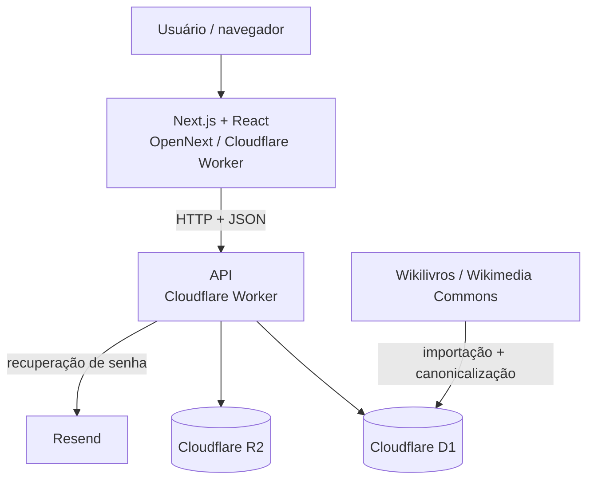
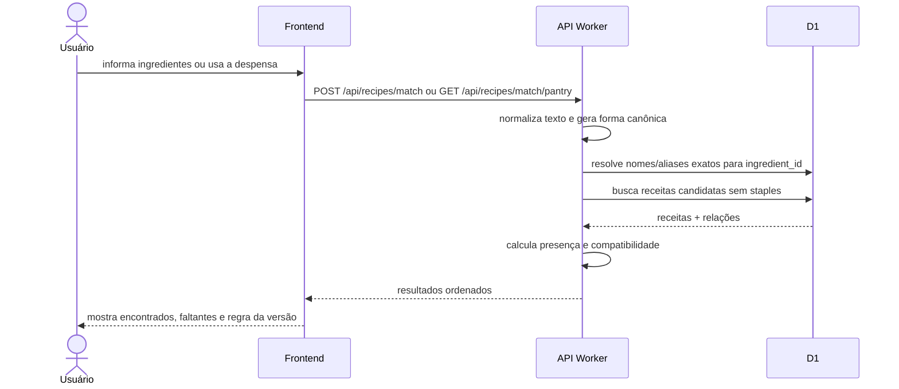
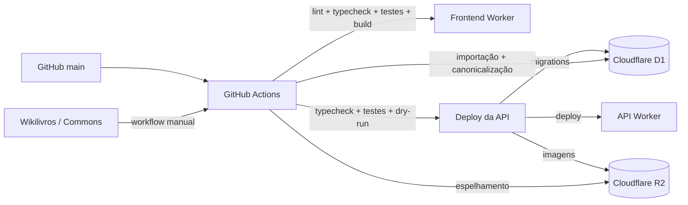

# Arquitetura do Receitando

## Visão geral

A produção atual do Receitando usa **Cloudflare Workers** tanto no frontend quanto na API. O frontend é uma aplicação Next.js compilada com OpenNext; a API é um Worker separado com persistência em Cloudflare D1 e armazenamento de imagens em Cloudflare R2.



O frontend nunca acessa o banco ou o bucket diretamente. Estado persistente passa pela API. O catálogo externo é importado por scripts/workflows separados da navegação em produção.

## Frontend

Diretório: `frontend/`.

Responsabilidades principais:

- navegação e layout;
- autenticação no cliente;
- catálogo e detalhes de receitas;
- matching em `/combinar`;
- despensa e favoritos;
- perfil e recuperação de senha;
- interação social;
- envio de receitas em `/enviar-receita`;
- moderação em `/admin/receitas` para administradores;
- estados de loading, erro e 404.

A camada `frontend/src/services/` concentra chamadas HTTP e `frontend/src/types/` descreve o contrato consumido pela interface.

A página `/receitas` usa `GET /api/v2/recipes`. O envio de receitas usa `POST /api/recipe-submissions` e o painel administrativo consome as rotas `/api/admin/recipe-submissions`.

## API

Diretório: `backend/worker-prototype/`.

Apesar do nome histórico, esta é a API atual de produção e a única implementação de backend mantida na árvore principal.

### Entrypoint real

`backend/worker-prototype/wrangler.jsonc` publica:

```text
src/session-cookie-worker.ts
```

O entrypoint cuida da sessão por cookie `HttpOnly`, CORS credenciado e proteção de `Origin` para mutações. Depois disso, ele delega a requisição para `app-router.ts`.

### Roteamento central

O runtime não depende mais de uma longa corrente em que cada Worker tenta reconhecer a rota e repassa para o próximo. `app-router.ts` escolhe diretamente o módulo responsável pela rota, na seguinte ordem de avaliação:

```text
session-cookie-worker
        ↓
app-router
   ├── auth-rate-limit-worker
   ├── home-worker
   ├── catalog-v2-worker
   ├── recipe-submission-worker
   ├── recipe-adaptation-worker
   ├── social-worker
   ├── catalog64-worker
   ├── profile-worker
   ├── password-reset-worker
   ├── pantry-worker
   └── index
```

Responsabilidades:

- `session-cookie-worker.ts`: cookie `HttpOnly`, CORS credenciado e defesa adicional contra CSRF;
- `app-router.ts`: dispatcher central de rotas;
- `auth-rate-limit-worker.ts`: rate limiting de login, cadastro e solicitação de recuperação;
- `home-worker.ts`: `/api/home-feed`;
- `catalog-v2-worker.ts`: catálogo público v2, filtros, ordenação e paginação;
- `recipe-submission-worker.ts`: submissões da comunidade, imagens no R2 e moderação ADMIN;
- `recipe-adaptation-worker.ts`: adaptação de rendimento e substituições;
- `social-worker.ts`: votos e comentários;
- `catalog64-worker.ts`: fontes, ingredientes, catálogo legado, detalhe, favoritos e matching;
- `profile-worker.ts`: leitura e atualização do perfil;
- `password-reset-worker.ts`: solicitação, validação e conclusão da recuperação de senha;
- `pantry-worker.ts`: despensa;
- `index.ts`: healthcheck, cadastro, login, logout e fallback final.

As rotas antigas de catálogo/matching que existiam também em `index.ts` foram removidas. O catálogo usado pela página `/receitas` fica em `catalog-v2-worker.ts`; matching, detalhe e contratos legados continuam em `catalog64-worker.ts`.

### Infraestrutura HTTP compartilhada

`src/lib/worker-http.ts` centraliza o contrato `Env` e helpers de CORS, respostas JSON/erro e autenticação interna. O ambiente inclui o binding D1 `db` e o binding R2 `RECIPE_IMAGES`. `src/lib/session-cookie.ts` concentra a política do cookie de sessão. `src/lib/recipe-utils.ts` concentra normalização canônica e regras puras do matching.

O `tsconfig.json` valida todo `src/**/*.ts`.

## Persistência

O banco de produção é **Cloudflare D1**. As migrations ficam em:

```text
backend/worker-prototype/migrations/
```

Elas definem contas, sessões, catálogo canônico de ingredientes, aliases, despensa, favoritos, recuperação de senha, perfis, votos, comentários, submissões da comunidade, moderação, rate limiting, FTS5 e metadados de fontes/imagens externas.

As imagens enviadas pela comunidade ficam no **Cloudflare R2**, no bucket `receitando-recipe-images`, ligado pelo binding `RECIPE_IMAGES`. O D1 guarda a URL associada à submissão/receita, não o binário da foto.

A API usa statements preparados e `.bind()` para valores recebidos por requisição. O frontend nunca envia SQL nem acessa D1 diretamente.

A integridade referencial é definida por chaves estrangeiras com `CASCADE`/`RESTRICT`. No D1, foreign keys são verificadas por padrão.

## Receitas da comunidade e moderação

O envio pode ser feito por usuário autenticado ou anônimo. Quando há sessão, o `user_id` é vinculado à submissão; sem sessão, permanece nulo.

No fluxo atual do frontend, a foto do prato é obrigatória. O Worker aceita arquivos de até 12 MB e detecta JPG, PNG ou WebP pelo conteúdo antes de gravar no R2. Se a imagem for gravada e a persistência da submissão falhar depois, o objeto recém-enviado é removido do bucket.

Toda submissão nasce `PENDING`. As rotas administrativas validam sessão com `users.role = 'ADMIN'`. A revisão pode marcar `APPROVED` ou `REJECTED` e registra `reviewed_by`, `reviewed_at`, `rejection_reason` e, na aprovação, `published_recipe_id`.

A aprovação cria uma receita com `source_type = 'USER'`. `catalog-v2-worker.ts` inclui essas receitas junto do acervo validado do Wikilivros.

## Autenticação e proteção contra abuso

O navegador recebe a sessão por cookie `HttpOnly`. Em produção o cookie usa `Secure`, `SameSite=Strict`, prefixo `__Host-` e `Path=/`. O frontend usa `credentials: "include"` e não persiste token bruto em `localStorage` ou `sessionStorage`.

Internamente, o Worker cria um token aleatório de sessão e o D1 armazena somente seu SHA-256. O entrypoint extrai o cookie e o converte para o mecanismo interno de autorização usado pelos módulos atuais; esse Bearer interno não faz parte do contrato público do frontend.

Senhas são derivadas com PBKDF2 via Web Crypto, usando salt aleatório por hash. Recuperações usam código temporário, limite de tentativas e token de reset armazenados apenas de forma derivada/hash.

Antes de login, cadastro e solicitação de recuperação, a camada de rate limiting mantém buckets em D1 para:

- login por e-mail e IP;
- cadastro por IP;
- solicitação de recuperação por e-mail e IP.

As chaves dos buckets também são persistidas apenas como hash.

## Matching



O catálogo usa `ingredients` como entidade canônica e `ingredient_aliases` para formas textuais alternativas. Um pós-processamento de catálogo consolida variações importadas para o mesmo `ingredient_id`.

A resolução não utiliza substring para inferir equivalência semântica. Compostos diferentes permanecem separados.

A fórmula atual é:

```text
compatibilidade = encontrados / obrigatórios não básicos × 100
```

Ingredientes opcionais e `is_staple = 1` não entram no denominador. Quantidades/unidades são persistidas, porém o matching desta versão é booleano (`tem` / `não tem`).

## Busca textual e catálogo v2

A busca do catálogo usa a tabela virtual FTS5 `recipe_search` para título e descrição.

Triggers no D1 mantêm o índice sincronizado com `recipes`. A API usa `MATCH` e `bm25()` em vez de `LIKE '%termo%'`, evitando table scan completo como estratégia principal de pesquisa textual.

O endpoint `GET /api/v2/recipes` aceita busca, fonte, tipo de refeição, dificuldade, tempo máximo, ordenação, limite e offset. Além do Wikilivros validado, ele inclui receitas aprovadas da comunidade com `source_type = 'USER'`.

## Catálogo externo e atribuição

A estratégia operacional usa:

- **Wikilivros em português** para conteúdo das receitas;
- **Wikimedia Commons** para imagens com licença livre.

O workflow manual executa:

```text
import-wikibooks-v2.mjs
        ↓
canonicalize-ingredients.mjs
        ↓
mirror-wikibooks-images-to-r2.mjs
```

O primeiro importa conteúdo/imagens; o segundo consolida ingredientes, aliases e staples; o terceiro espelha imagens do catálogo para o R2.

O conteúdo culinário importado é convertido para texto; a tela de receita não renderiza HTML bruto da fonte externa. Metadados separados da receita e da imagem são preservados para atribuição.

## Código legado

A implementação anterior em NestJS + Prisma + PostgreSQL foi removida da árvore principal para não competir com a arquitetura de produção.

Ela permanece preservada na branch:

```text
legacy/nest-prisma
```

Também saiu da árvore ativa o `docker-compose.yml` usado exclusivamente pelo backend antigo.

## Deploy e CI



Frontend e API possuem validações e deploys separados. Migrations remotas da API são aplicadas somente depois das validações definidas no workflow.

Credenciais ficam em GitHub Secrets/Cloudflare Secrets, nunca no repositório.

## Desenvolvimento local

| Componente | Endereço padrão |
| --- | --- |
| Frontend | `http://localhost:3000` |
| API Worker | `http://localhost:8787` |
| D1 | banco local gerenciado pelo Wrangler |

## Documentação relacionada

- [`escopo.md`](escopo.md)
- [`funcionalidades.md`](funcionalidades.md)
- [`api.md`](api.md)
- [`database.md`](database.md)
- [`catalogo.md`](catalogo.md)
- [`mobile-upload-login.md`](mobile-upload-login.md)
- [`deploy.md`](deploy.md)
- [`estrutura-repositorio.md`](estrutura-repositorio.md)
