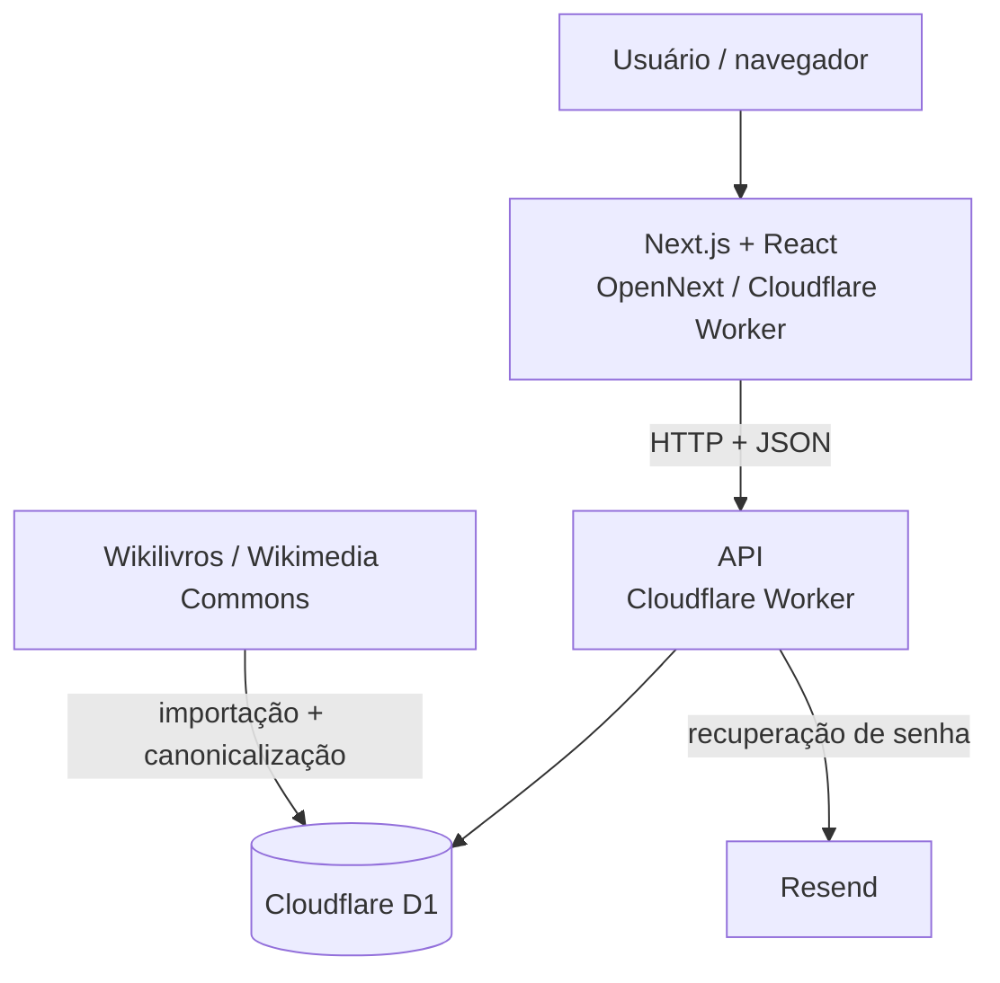
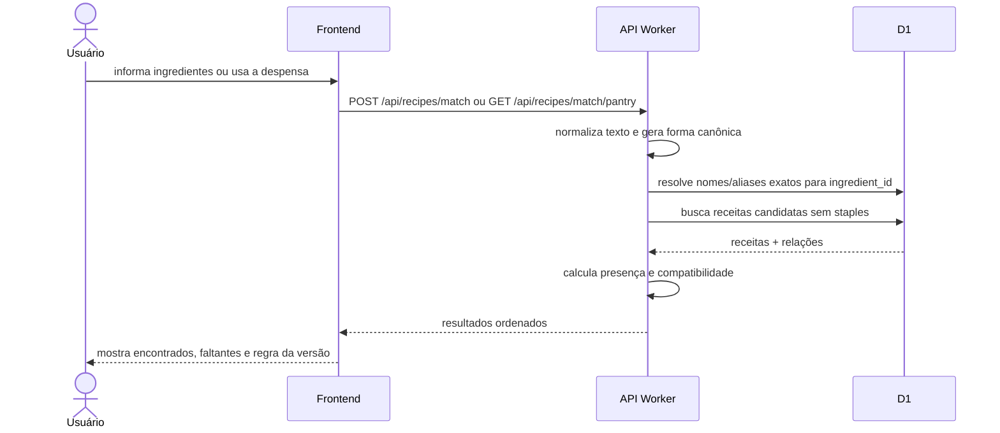
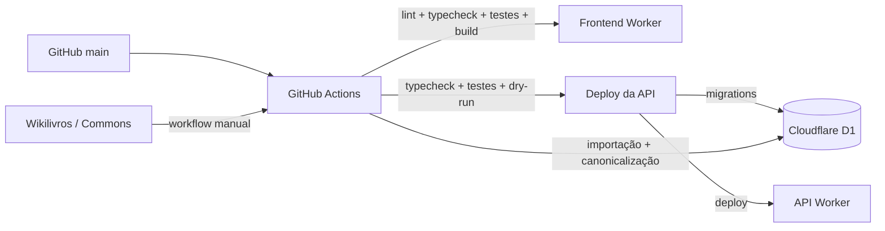

# Arquitetura do Receitando

## Visão geral

A produção atual do Receitando usa **Cloudflare Workers** tanto no frontend quanto na API. O frontend é uma aplicação Next.js compilada com OpenNext; a API é um Worker separado com persistência em Cloudflare D1.



O frontend nunca acessa o banco diretamente. Estado persistente passa pela API. O catálogo externo é importado por scripts/workflows separados da navegação em produção.

## Frontend

Diretório: `frontend/`.

Responsabilidades principais:

- navegação e layout;
- autenticação no cliente;
- catálogo e detalhes de receitas;
- matching em `/combinar`;
- despensa e favoritos;
- perfil e recuperação de senha;
- interação social;
- estados de loading, erro e 404.

A camada `frontend/src/services/` concentra chamadas HTTP e `frontend/src/types/` descreve o contrato consumido pela interface.

## API

Diretório: `backend/worker-prototype/`.

Apesar do nome histórico, esta é a API atual de produção e a única implementação de backend mantida na árvore principal.

### Entrypoint real

`backend/worker-prototype/wrangler.jsonc` publica:

```text
src/auth-rate-limit-worker.ts
```

A API utiliza uma cadeia de Workers especializados:

```text
auth-rate-limit-worker
        ↓
home-worker
        ↓
catalog64-worker
        ↓
social-worker
        ↓
profile-worker
        ↓
password-reset-worker
        ↓
pantry-worker
        ↓
index
```

- `auth-rate-limit-worker`: rate limiting de login, cadastro e solicitação de recuperação;
- `home-worker`: `/api/home-feed`;
- `catalog64-worker`: fontes, ingredientes, busca FTS5, catálogo, detalhe, favoritos e matching;
- `social-worker`: votos e comentários;
- `profile-worker`: leitura e atualização do perfil;
- `password-reset-worker`: solicitação, validação e conclusão da recuperação de senha;
- `pantry-worker`: despensa;
- `index`: healthcheck, cadastro, login, sessão atual, logout e fallback final.

Rotas antigas de catálogo/matching que existiam também em `index.ts` foram removidas para existir **uma única implementação canônica** em `catalog64-worker.ts`.

### Infraestrutura HTTP compartilhada

`src/lib/worker-http.ts` centraliza o contrato `Env` e helpers de CORS, respostas JSON/erro e autenticação. `src/lib/recipe-utils.ts` concentra normalização canônica e regras puras do matching.

O `tsconfig.json` valida todo `src/**/*.ts`.

## Persistência

O banco de produção é **Cloudflare D1**. As migrations ficam em:

```text
backend/worker-prototype/migrations/
```

Elas definem contas, sessões, catálogo canônico de ingredientes, aliases, despensa, favoritos, recuperação de senha, perfis, votos, comentários, rate limiting, FTS5 e metadados de fontes/imagens externas.

A API usa statements preparados e `.bind()` para valores recebidos por requisição. O frontend nunca envia SQL nem acessa D1 diretamente.

A integridade referencial é definida por chaves estrangeiras com `CASCADE`/`RESTRICT`. No D1, foreign keys são verificadas por padrão.

## Autenticação e proteção contra abuso

No contrato atualmente publicado, o login cria um token aleatório de sessão e o banco guarda somente seu SHA-256. Senhas são derivadas com PBKDF2 via Web Crypto, usando salt aleatório por hash.

Recuperações usam código temporário, limite de tentativas e token de reset armazenados apenas de forma derivada/hash.

Antes de delegar a essas rotas, o entrypoint mantém buckets em D1 para:

- login por e-mail e IP;
- cadastro por IP;
- solicitação de recuperação por e-mail e IP.

As chaves dos buckets também são persistidas apenas como hash.

## Matching



O catálogo usa `ingredients` como entidade canônica e `ingredient_aliases` para formas textuais alternativas. Um pós-processamento de catálogo consolida variações importadas para o mesmo `ingredient_id`.

A resolução não utiliza substring para inferir equivalência semântica. Compostos diferentes permanecem separados.

A fórmula atual é:

```text
compatibilidade = encontrados / obrigatórios não básicos × 100
```

Ingredientes opcionais e `is_staple = 1` não entram no denominador. Quantidades/unidades são persistidas, porém o matching desta versão é booleano (`tem` / `não tem`).

## Busca textual

A busca do catálogo usa a tabela virtual FTS5 `recipe_search` para título e descrição.

Triggers no D1 mantêm o índice sincronizado com `recipes`. A API usa `MATCH` e `bm25()` em vez de `LIKE '%termo%'`, evitando table scan completo como estratégia principal de pesquisa textual.

## Catálogo externo e atribuição

A estratégia operacional usa:

- **Wikilivros em português** para conteúdo das receitas;
- **Wikimedia Commons** para imagens com licença livre.

O workflow manual executa:

```text
import-wikibooks-v2.mjs
        ↓
canonicalize-ingredients.mjs
```

O primeiro importa conteúdo/imagens; o segundo consolida ingredientes, aliases e staples.

O conteúdo culinário importado é convertido para texto; a tela de receita não renderiza HTML bruto da fonte externa. Metadados separados da receita e da imagem são preservados para atribuição.

## Código legado

A implementação anterior em NestJS + Prisma + PostgreSQL foi removida da árvore principal para não competir com a arquitetura de produção.

Ela permanece preservada na branch:

```text
legacy/nest-prisma
```

Também saiu da árvore ativa o `docker-compose.yml` usado exclusivamente pelo backend antigo.

## Deploy e CI



Frontend e API possuem validações e deploys separados. Migrations remotas da API são aplicadas somente depois das validações definidas no workflow.

Credenciais ficam em GitHub Secrets/Cloudflare Secrets, nunca no repositório.

## Desenvolvimento local

| Componente | Endereço padrão |
| --- | --- |
| Frontend | `http://localhost:3000` |
| API Worker | `http://localhost:8787` |
| D1 | banco local gerenciado pelo Wrangler |

## Documentação relacionada

- [`escopo.md`](escopo.md)
- [`funcionalidades.md`](funcionalidades.md)
- [`api.md`](api.md)
- [`database.md`](database.md)
- [`catalogo.md`](catalogo.md)
- [`deploy.md`](deploy.md)
- [`estrutura-repositorio.md`](estrutura-repositorio.md)
