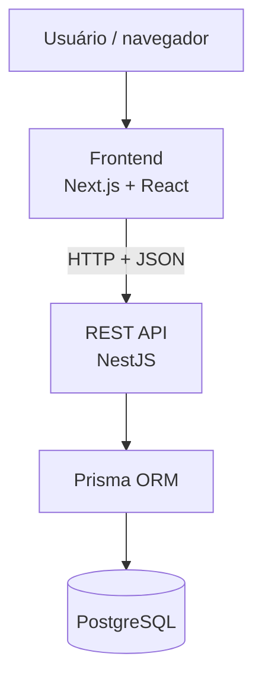
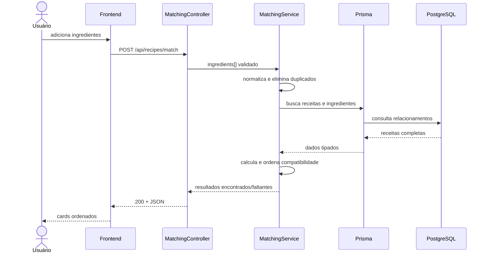
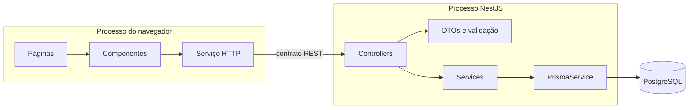

# Arquitetura do Receitando

## Visão geral

O Receitando adota uma arquitetura cliente-servidor simples, adequada ao aprendizado e preparada para crescer por módulos. O frontend nunca acessa o banco diretamente: toda leitura e escrita passa pela API REST, que concentra validação, regras de negócio e persistência.



Em desenvolvimento, os componentes usam estas URLs:

| Componente | Endereço |
| --- | --- |
| Frontend | `http://localhost:3000` |
| API REST | `http://localhost:3333/api` |
| Swagger | `http://localhost:3333/api/docs` |
| PostgreSQL | `localhost:5432` |

## Responsabilidades

### Frontend

O Next.js usa App Router e componentes React. As páginas organizam a navegação e a apresentação; componentes reutilizáveis implementam a interface; e a camada de serviços concentra chamadas HTTP. Assim, componentes visuais não espalham detalhes de `fetch`, URLs ou tratamento de respostas.

Principais áreas:

- home e `IngredientMatcher`, responsáveis pelo fluxo central;
- catálogo em `/receitas`;
- detalhes em `/receitas/[slug]`;
- estruturas futuras em `/despensa` e `/favoritos`;
- componentes compartilhados e tokens visuais centralizados.

### Backend

O NestJS expõe uma API com prefixo global `/api`. A separação interna segue responsabilidades claras:

- **controllers**: recebem HTTP, encaminham dados e definem o contrato de resposta;
- **DTOs**: validam e documentam entradas;
- **services**: aplicam regras de negócio;
- **PrismaService**: concentra o acesso e o ciclo de vida da conexão;
- **Prisma Client**: traduz operações tipadas para o PostgreSQL.

Os módulos iniciais são `ingredients`, `recipes` e `matching`. O healthcheck é independente e serve para diagnóstico da API.

### Banco de dados

O PostgreSQL armazena usuários, ingredientes, receitas e seus relacionamentos. A tabela associativa `RecipeIngredient` contém os atributos da participação de um ingrediente na receita, como quantidade, unidade e obrigatoriedade. `PantryItem` e `Favorite` preparam o modelo para fases futuras sem exigir suas interfaces completas agora.

O Prisma mantém o schema, migrations, cliente tipado e seed. A aplicação não depende de SQL manual para o fluxo comum.

## Fluxo do motor de compatibilidade



A compatibilidade inicial é:

```text
ingredientes obrigatórios encontrados
───────────────────────────────────── × 100
 total de ingredientes obrigatórios
```

O resultado é arredondado para inteiro. Ingredientes opcionais podem ser exibidos, mas não reduzem o percentual. A normalização remove espaços externos, converte para minúsculas e remove marcas de acentuação; sinônimos permanecem fora do escopo desta fase.

## Limites e dependências



Regras importantes:

- regra de negócio não fica em controllers nem em componentes visuais;
- validação ocorre na fronteira da API;
- detalhes do banco não vazam nas mensagens ao usuário;
- o frontend depende do contrato REST, não do Prisma;
- módulos futuros devem reutilizar `Ingredient` em vez de criar cadastros paralelos.

## Decisões para evolução

- **Monorepositório simples:** duas aplicações independentes facilitam ensino, execução e deploy separado.
- **API REST versionável:** o prefixo `/api` mantém espaço para infraestrutura; uma versão explícita poderá ser adicionada quando houver clientes externos.
- **Relações preparadas:** despensa e favoritos já possuem entidades, mas suas regras serão implementadas com autenticação.
- **Normalização centralizada:** todas as comparações devem chamar a mesma função para impedir resultados divergentes.
- **Serviço de matching isolado:** no futuro ele poderá incluir quantidades, substituições, preferências ou validade sem alterar o contrato básico das receitas.

## Implantação futura

O Compose atual executa somente o PostgreSQL local. Frontend e backend continuam como processos de desenvolvimento para manter hot reload e depuração simples. Em produção, cada aplicação pode ser empacotada separadamente, com `DATABASE_URL`, origem CORS e URL pública da API definidas pelo ambiente. Redis, filas e outros serviços só devem ser adicionados quando existir uma necessidade concreta.
