# Catálogo de receitas e licenças

Este documento descreve de onde vêm as receitas exibidas no Receitando, como elas são importadas e quais cuidados são adotados com origem, licença e imagens.

## Fonte atual do catálogo

O catálogo publicado pelo projeto utiliza **Wikilivros em português** como fonte de conteúdo de receitas.

Para imagens, o importador utiliza arquivos do **Wikimedia Commons** associados à receita ou encontrados por busca controlada quando não existe uma imagem adequada diretamente vinculada à página.

O objetivo é manter um catálogo com:

- título da receita;
- ingredientes;
- modo de preparo;
- categoria;
- imagem utilizável;
- URL de origem;
- identificação da fonte;
- informações de autoria e licença quando disponíveis.

## Fluxo de importação

```mermaid
flowchart LR
    A[GitHub Actions] --> B[API do Wikilivros]
    B --> C[Descoberta de páginas de receitas]
    C --> D[Extração de ingredientes e preparo]
    D --> E[Busca de imagem]
    E --> F[Wikimedia Commons]
    F --> G[Validação de licença e metadados]
    G --> H[SQL em lotes]
    H --> I[(Cloudflare D1)]
    I --> J[API do Receitando]
    J --> K[Frontend]
```



O workflow responsável fica em:

```text
.github/workflows/import-wikibooks.yml
```

O importador atual fica em:

```text
backend/worker-prototype/scripts/import-wikibooks-v2.mjs
```

## Respeito aos limites da Wikimedia

O importador foi preparado para trabalhar com os limites das APIs do ecossistema Wikimedia.

Ele possui:

- controle de velocidade das requisições;
- tentativas automáticas em respostas `429` e erros temporários `5xx`;
- respeito ao cabeçalho `Retry-After`;
- backoff progressivo;
- consultas em lote para reduzir o número de chamadas;
- logs de progresso durante a importação.

## Critérios para aceitar uma receita

Uma página precisa ser interpretável como receita. O importador procura estrutura suficiente para extrair ingredientes e modo de preparo.

Além disso, para o catálogo atual, a receita precisa possuir uma imagem livre adequada.

Páginas auxiliares, índices, textos sem estrutura aproveitável e receitas sem imagem compatível podem ser ignorados.

Por isso, o total de páginas existentes no Wikilivros não corresponde necessariamente ao total de receitas que entram no banco.

## Imagens

A estratégia de imagens segue duas etapas principais:

1. procurar imagens já relacionadas à página da receita;
2. quando necessário, pesquisar no Wikimedia Commons usando o nome da receita e validar se o resultado é compatível.

São evitados arquivos que pareçam ícones, logotipos, mapas ou imagens institucionais sem relação direta com o prato.

## Metadados armazenados

O schema do D1 possui campos específicos para a imagem e sua atribuição, incluindo:

- `image_url`;
- `image_source`;
- `image_author`;
- `image_page_url`;
- `image_license`;
- `image_license_url`;
- `image_alt`.

Também são armazenados metadados da própria receita, como origem externa, URL da fonte, autor da fonte, licença, idioma e data de importação.

## Licenças

Conteúdo livre não significa conteúdo sem autoria.

Quando uma receita ou imagem exige atribuição, os metadados necessários devem ser preservados. O projeto evita tratar conteúdo Creative Commons como se fosse domínio público.

O código deve continuar armazenando e expondo informações suficientes para identificar a fonte e a licença aplicável.

## Fonte única atual

A estratégia atual do projeto é manter o catálogo publicado com **Wikilivros + Wikimedia Commons**.

Importadores experimentais de bases anteriores não representam a fonte atual de produção e não devem ser usados para repopular o catálogo sem uma decisão explícita do projeto.

## Operação

A importação é acionada manualmente no GitHub Actions. O usuário responsável escolhe o escopo e a meta de receitas.

A rotina:

1. aplica migrations necessárias;
2. valida o importador;
3. descobre páginas candidatas;
4. interpreta as receitas;
5. encontra e valida imagens;
6. grava receitas no D1 em lotes;
7. mantém o catálogo alinhado à estratégia de fonte atual.

## Documentos relacionados

- [`escopo.md`](escopo.md)
- [`architecture.md`](architecture.md)
- [`database.md`](database.md)
- [`deploy.md`](deploy.md)
