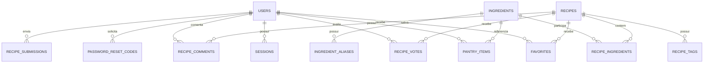

# Modelo de dados atual

A persistência relacional de produção do Receitando usa **Cloudflare D1**. O schema é versionado por migrations SQL em `backend/worker-prototype/migrations/`. Imagens enviadas pela comunidade ficam no **Cloudflare R2** e o D1 persiste a URL associada.

## Visão geral



`recipe_submissions.user_id` é opcional, portanto submissões anônimas não possuem relação com `users`.

## Tabelas principais

### `users`

Contas da aplicação. Campos relevantes: `id`, `name`, `email`, `password_hash`, `role`, `handle`, `avatar_key` e timestamps. Senhas nunca são persistidas em texto puro.

O campo `role` diferencia usuários comuns e administradores. As rotas de moderação exigem `role = 'ADMIN'`.

### `sessions`

Associa uma sessão a `user_id`, guarda somente `token_hash`, possui expiração e `last_seen_at` e é removida em cascata quando a conta é apagada.

### `ingredients` e `ingredient_aliases`

`ingredients` é o catálogo canônico usado pelo matching. Cada registro possui um `normalized_name` único e, a partir da migration `0015_matching_search_hardening.sql`, a flag `is_staple`.

`ingredient_aliases` associa variações textuais ao mesmo `ingredient_id`. Assim `cebolas picadas`, `cebolas` e `cebola` podem apontar para a mesma entidade sem que a aplicação dependa de comparação parcial de strings.

`is_staple = 1` identifica ingredientes básicos que não penalizam a compatibilidade, como água, sal, pimenta e óleos genéricos definidos pela política atual.

### `recipes`

Dados culinários:

- `id`, `title`, `slug`, `description`, `instructions`;
- `prep_minutes`, `servings`, `meal_type`, `difficulty`;
- timestamps.

Procedência da receita:

- `source_type`, `source_name`, `source_url`;
- `source_author`, `source_license`, `source_license_url`, `source_language`;
- `external_source`, `external_id`, `external_category`, `imported_at`.

Metadados específicos da imagem:

- `image_url`;
- `image_source`;
- `image_author`;
- `image_page_url`;
- `image_license`;
- `image_license_url`;
- `image_alt`.

Receitas aprovadas da comunidade são publicadas com `source_type = 'USER'` e `source_name = 'Comunidade Receitando'`, o que as torna elegíveis no catálogo v2.

### `recipe_ingredients`

Relação receita/ingrediente, com quantidade, unidade, flag `optional` e `raw_text` quando disponível. O par receita/ingrediente é único.

Quantidade e unidade são persistidas para informação culinária e evolução do produto, mas a regra atual de matching é booleano: presença ou ausência do ingrediente.

### `pantry_items`

Despensa por usuário. Quantidade, unidade e validade são opcionais. O par usuário/ingrediente é único; nova inclusão do mesmo ingrediente atualiza o item existente.

### `favorites`, `recipe_votes` e `recipe_comments`

Relacionamentos da comunidade social. Chaves estrangeiras e chaves compostas impedem relações inválidas ou duplicadas conforme o caso.

### `recipe_submissions`

Fila de receitas enviadas pela comunidade. Foi criada por `0013_recipe_submissions.sql` e ampliada por `0016_recipe_submission_moderation.sql`.

Campos principais:

- identidade e autoria: `id`, `user_id`, `author_name`, `author_email`;
- conteúdo: `title`, `description`, `ingredients`, `instructions`, `prep_minutes`, `servings`, `meal_type`, `difficulty`;
- imagem: `image_url`;
- fluxo: `status`, `created_at`, `updated_at`;
- moderação: `reviewed_by`, `reviewed_at`, `published_recipe_id`, `rejection_reason`.

`user_id` aceita `NULL`, permitindo envio anônimo. O status começa em `PENDING` e aceita apenas `PENDING`, `APPROVED` ou `REJECTED`.

`published_recipe_id` possui índice único parcial quando preenchido, impedindo que duas submissões apontem para a mesma receita publicada.

### `password_reset_codes`

Estado temporário da recuperação de senha. Persiste hashes do código/token de reset, tentativas, expiração, verificação e uso; os segredos reais não são armazenados em texto puro.

### `auth_rate_limit_events`

Registra eventos temporários usados para limitar abuso de login, cadastro e solicitação de recuperação de senha. O identificador do bucket é persistido apenas como SHA-256.

## Cloudflare R2

O binário das fotos enviadas pela comunidade não fica no D1. O Worker usa o binding:

```text
RECIPE_IMAGES → receitando-recipe-images
```

Arquivos de submissão são gravados sob:

```text
submissions/AAAA/MM/{submissionId}.{ext}
```

A API persiste em `recipe_submissions.image_url` a URL servida por:

```text
/api/recipe-submission-images/:key
```

Se o upload for concluído no R2 e a inserção no D1 falhar, `recipe-submission-worker.ts` apaga o objeto recém-criado para não deixar arquivo órfão.

## Integridade referencial

As migrations definem `FOREIGN KEY` com políticas `ON DELETE CASCADE`, `SET NULL` ou `ON DELETE RESTRICT` conforme a relação.

Exemplos:

- apagar um usuário remove sessões, despensa, favoritos, votos e comentários associados;
- em submissões, apagar o usuário associado preserva o envio e define `user_id` como `NULL`;
- apagar uma receita remove favoritos, votos, comentários, tags e relações com ingredientes;
- ingredientes referenciados por receitas/despensa não são removidos de forma destrutiva antes de suas relações serem tratadas.

No Cloudflare D1, a verificação de chaves estrangeiras é habilitada por padrão. As migrations antigas também registram `PRAGMA foreign_keys = ON` por clareza histórica. Não é necessário executar esse `PRAGMA` a cada requisição da API.

## Índices

O schema já possuía índices e índices automáticos derivados de `PRIMARY KEY`/`UNIQUE`. A migration `0015_matching_search_hardening.sql` adiciona índices explícitos para padrões de acesso frequentes que não eram cobertos pelo prefixo ideal:

```text
idx_pantry_items_user_id
idx_pantry_items_user_updated_at
idx_recipe_ingredients_recipe_id
idx_favorites_user_created_at
```

Submissões possuem índices por status/data, usuário/data, data de revisão e receita publicada.

Também continuam existentes índices para sessões, aliases, votos, comentários, ingredientes e relações por receita/ingrediente.

## Busca textual com FTS5

A busca do catálogo não usa mais `LIKE '%termo%'` para localizar títulos. A migration `0015_matching_search_hardening.sql` cria a tabela virtual FTS5:

```text
recipe_search
```

Ela indexa `title` e `description` e é mantida sincronizada com `recipes` por triggers de inserção, atualização e exclusão.

A API consulta `recipe_search MATCH ?` e ordena por `bm25()`, permitindo termos múltiplos e prefixos sem realizar um table scan completo do catálogo a cada busca textual.

Como receitas aprovadas da comunidade são inseridas em `recipes`, os triggers também as incorporam ao índice FTS5.

## Normalização e matching

O fluxo atual é:

1. normalizar caixa, acentos e separadores;
2. gerar a forma textual completa e uma forma canônica conservadora;
3. resolver correspondências exatas em `ingredients.normalized_name` e `ingredient_aliases.normalized_alias`;
4. converter tudo para `ingredient_id`;
5. excluir ingredientes opcionais e `is_staple = 1` do denominador;
6. calcular compatibilidade com os ingredientes obrigatórios restantes.

```text
compatibilidade = ingredientes obrigatórios não básicos encontrados
                  ------------------------------------------------ × 100
                  total de ingredientes obrigatórios não básicos
```

A aplicação não usa substring para decidir equivalência entre ingredientes. Por isso, `óleo` não implica automaticamente `óleo de gergelim torrado`, e `açúcar` não implica `açúcar de confeiteiro`.

## Histórico das migrations

Migrations já aplicadas são **histórico imutável**. Mesmo quando uma estratégia de catálogo é substituída, arquivos antigos não devem ser renumerados ou reescritos.

### `0008b_prepare_catalog_v3b.sql`

O sufixo `b` é intencional. Essa migration foi adicionada entre `0008_seed_catalog_v3.sql` e `0009_seed_catalog_v3b.sql` como etapa preparatória da expansão v3b e deve permanecer com esse nome.

### Prefixo `0013`

Existem duas migrations já compartilhadas com o prefixo `0013`:

- `0013_recipe_image_attribution.sql`;
- `0013_recipe_submissions.sql`.

A colisão de prefixo é histórica. Os arquivos não devem ser renumerados retroativamente; migrations novas devem continuar com nomes inéditos.

### Migrations recentes

- `0011_external_catalog.sql`: identidade de fonte externa/deduplicação;
- `0012_recipe_source_attribution.sql`: procedência da receita;
- `0013_recipe_image_attribution.sql`: atribuição da imagem;
- `0013_recipe_submissions.sql`: fila de receitas enviadas pela comunidade;
- `0014_auth_rate_limits.sql`: eventos de rate limiting;
- `0015_matching_search_hardening.sql`: ingredientes básicos, índices adicionais e FTS5;
- `0016_recipe_submission_moderation.sql`: campos e índices de revisão/publicação das submissões.

## Execução

Local:

```bash
cd backend/worker-prototype
npm run migrate:local
```

Produção:

```bash
cd backend/worker-prototype
npm run migrate:remote
```

No deploy oficial, migrations remotas são aplicadas somente depois das validações previstas no workflow da API.

## Segurança

O schema e migrations podem ser públicos. O que deve permanecer privado são credenciais, chaves, tokens reais, códigos de recuperação e dados privados dos usuários.

As imagens de submissão são validadas por conteúdo e tamanho antes de serem mantidas no R2. A rota de entrega restringe chaves ao prefixo `submissions/` e bloqueia travessia de caminho.

## Documentos relacionados

- [`architecture.md`](architecture.md)
- [`api.md`](api.md)
- [`funcionalidades.md`](funcionalidades.md)
- [`mobile-upload-login.md`](mobile-upload-login.md)
- [`catalogo.md`](catalogo.md)
- [`deploy.md`](deploy.md)
