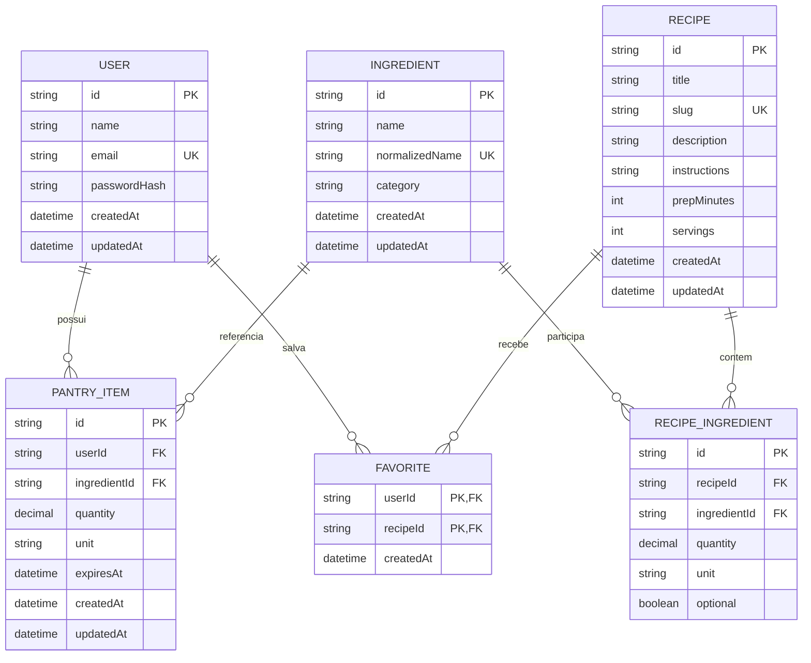

# Modelo de dados

O PostgreSQL é a fonte de verdade da aplicação e o Prisma gerencia schema, migrations, cliente e seed. O modelo inicial permite executar o fluxo de receitas e compatibilidade agora, preservando pontos de extensão para despensa e favoritos.

## Diagrama entidade-relacionamento



## Entidades

### User

Representa a conta que futuramente terá despensa, favoritos e preferências. `email` deve ser único. `passwordHash` nunca guarda senha em texto puro nem é devolvido pela API. A autenticação não faz parte da primeira fase.

### Ingredient

É o catálogo canônico de ingredientes. `name` preserva a forma legível; `normalizedName` é a chave de comparação em minúsculas, sem espaços externos e sem acentos. Esse campo deve ser único para impedir cadastros equivalentes como `Açúcar` e `acucar`. `category` permite filtros futuros.

### Recipe

Contém os dados editoriais da receita. `slug` é único e usado na URL pública. `prepMinutes` e `servings` devem ser inteiros positivos. `instructions` armazena o modo de preparo textual nesta fase.

### RecipeIngredient

Resolve a relação muitos-para-muitos entre receitas e ingredientes. Além das chaves estrangeiras, registra `quantity`, `unit` e `optional`. O par (`recipeId`, `ingredientId`) deve ser único: o mesmo ingrediente não deve aparecer duas vezes em uma receita.

`optional = false` significa que o ingrediente participa do denominador do matching. Ingredientes opcionais não diminuem o percentual quando ausentes.

### PantryItem

Representa um ingrediente na despensa de uma pessoa. Quantidade, unidade e validade são opcionais do ponto de vista do domínio porque o usuário pode apenas informar que possui um item. A integração completa depende de autenticação e fica para uma fase futura.

### Favorite

Associa usuário e receita. A chave composta (`userId`, `recipeId`) impede favoritar a mesma receita mais de uma vez.

## Integridade e índices

Restrições recomendadas no schema Prisma:

- unicidade em `User.email`, `Ingredient.normalizedName` e `Recipe.slug`;
- unicidade composta em `RecipeIngredient(recipeId, ingredientId)`;
- chave composta em `Favorite(userId, recipeId)`;
- índices nas chaves estrangeiras usadas em junções;
- exclusão em cascata de itens associativos quando sua receita ou usuário for removido;
- restrição de exclusão de ingrediente enquanto houver receitas ou despensas que o referenciem, salvo quando a regra de negócio tratar a operação explicitamente.

A API deve converter violações conhecidas de unicidade ou referência em erros HTTP adequados (`409 Conflict` ou `400 Bad Request`) e nunca expor mensagens internas do PostgreSQL.

## Normalização

O valor normalizado é derivado pela aplicação, não digitado pelo cliente:

1. remover espaços no início e no fim;
2. converter para minúsculas;
3. decompor Unicode;
4. remover marcas diacríticas;
5. manter o restante do nome sem inferir sinônimos.

Exemplos:

| Entrada | `normalizedName` |
| --- | --- |
| `Tomate` | `tomate` |
| `  TOMATE ` | `tomate` |
| `Açúcar` | `acucar` |

Essa mesma função deve ser usada no cadastro, na atualização e no matching.

## Migrations e seed

Com o PostgreSQL disponível e `DATABASE_URL` configurada:

```bash
npm --prefix backend run prisma:migrate
npm --prefix backend run prisma:seed
```

O seed é idempotente sempre que possível e fornece pelo menos 15 ingredientes, 8 receitas e relacionamentos reais para exercitar percentuais completos, parciais e zero. Dados de seed são destinados a desenvolvimento e demonstração.

Para inspecionar os registros com a interface do Prisma:

```bash
npm --prefix backend run prisma:studio
```

Antes de criar uma migration, altere `backend/prisma/schema.prisma` e gere uma mudança com nome descritivo. Migrations já compartilhadas não devem ser reescritas; correções posteriores devem entrar em uma nova migration.
