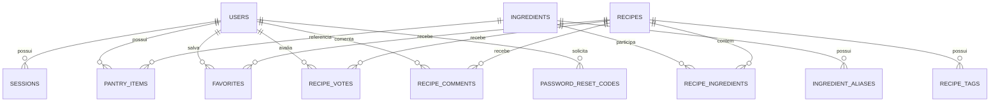

# Modelo de dados atual

A persistência de produção do Receitando usa **Cloudflare D1**. O schema é versionado por migrations SQL em `backend/worker-prototype/migrations/`.

## Visão geral



## Tabelas principais

### `users`

Contas da aplicação.

Campos relevantes:

- `id`;
- `name`;
- `email` único;
- `password_hash`;
- `role` (`USER` ou `ADMIN`);
- `handle` único quando preenchido;
- `avatar_key`;
- timestamps.

Senhas nunca são salvas em texto puro.

### `sessions`

Sessões autenticadas.

- associa uma sessão a `user_id`;
- guarda somente `token_hash`;
- possui expiração e `last_seen_at`;
- é apagada em cascata quando a conta é removida.

O token real existe apenas no cliente durante a sessão.

### `ingredients`

Catálogo canônico de ingredientes.

- `name`: nome exibido;
- `normalized_name`: forma normalizada e única;
- `category`: categoria do ingrediente.

### `ingredient_aliases`

Variações conhecidas de nomes apontando para um ingrediente canônico.

Exemplo conceitual:

```text
"farinha trigo" → "farinha de trigo"
"mussarela"     → ingrediente canônico de queijo
```

O matching consulta tanto o nome canônico quanto aliases.

### `recipes`

Dados principais das receitas.

#### Conteúdo culinário

- `id`;
- `title`;
- `slug` público;
- `description`;
- `instructions`;
- `prep_minutes`;
- `servings`;
- `meal_type`;
- `difficulty`;
- timestamps.

#### Origem da receita

- `source_type`;
- `source_name`;
- `source_url`;
- `source_author`;
- `source_license`;
- `source_license_url`;
- `source_language`;
- `external_source`;
- `external_id`;
- `external_category`;
- `imported_at`.

Tipos de origem aceitos pelo schema:

```text
OWN
OPEN_DATASET
USER
```

A política atual do catálogo publicado utiliza `OPEN_DATASET` com `external_source = wikibooks`. Os demais tipos continuam previstos pelo modelo de dados, embora não sejam a fonte operacional atual do catálogo.

Os campos externos permitem deduplicação por fonte e identificador sem depender apenas do título.

#### Imagem e atribuição

O schema também preserva metadados próprios da imagem:

- `image_url`;
- `image_source`;
- `image_author`;
- `image_page_url`;
- `image_license`;
- `image_license_url`;
- `image_alt`.

Isso permite manter a procedência da imagem separada da procedência do texto da receita. Atualmente nem todos esses campos são expostos pelo contrato público da API, mas eles permanecem persistidos no D1 para atribuição e auditoria.

### `recipe_ingredients`

Relação entre receita e ingrediente.

Além das chaves, pode armazenar:

- quantidade;
- unidade;
- indicação de ingrediente opcional;
- texto bruto importado quando disponível.

O par receita/ingrediente é único.

### `recipe_tags`

Tags editoriais ou de classificação associadas às receitas.

### `pantry_items`

Itens da despensa de cada usuário.

- `user_id`;
- `ingredient_id`;
- quantidade opcional;
- unidade opcional;
- validade opcional;
- timestamps.

O par usuário/ingrediente é único. Adicionar novamente o mesmo ingrediente atualiza o item existente.

### `favorites`

Relaciona usuários e receitas favoritas.

A chave composta (`user_id`, `recipe_id`) impede duplicidade.

### `recipe_votes`

Uma avaliação por usuário e receita.

Valores aceitos:

```text
LIKE
DISLIKE
```

### `recipe_comments`

Comentários da comunidade ligados a usuário e receita, com timestamps de criação e edição.

### `password_reset_codes`

Estado temporário da recuperação de senha.

Armazena hashes do código e do token temporário, contador de tentativas, expiração, verificação e uso. O código real e o token real não são persistidos em texto puro.

## Normalização de ingredientes

A aplicação normaliza os nomes antes de comparar:

1. decompõe Unicode;
2. remove acentos;
3. remove espaços externos;
4. converte para minúsculas;
5. reduz espaços repetidos;
6. no matching atual, hífen e `_` também podem ser tratados como separadores.

A tabela de aliases cobre variações que não podem ser resolvidas apenas por normalização textual.

## Matching

O motor considera principalmente relações de `recipe_ingredients` com `optional = 0`.

```text
compatibilidade = ingredientes obrigatórios encontrados
                  ------------------------------------- × 100
                  total de ingredientes obrigatórios
```

Os resultados também carregam listas de ingredientes encontrados, faltantes e opcionais.

## Evolução do catálogo nas migrations

O diretório de migrations preserva a evolução histórica do banco. Por isso existem migrations antigas de seed de catálogos anteriores. Elas não definem a fonte operacional atual por si só e **não devem ser reescritas**, pois migrations já aplicadas fazem parte do histórico do schema.

As migrations mais recentes relacionadas à procedência são:

- `0011_external_catalog.sql`: identidade de fonte externa e deduplicação;
- `0012_recipe_source_attribution.sql`: URL, autor, licença, idioma e data de importação da receita;
- `0013_recipe_image_attribution.sql`: fonte, autor, página, licença e texto alternativo da imagem.

A política atual de manter o catálogo publicado em Wikilivros/Commons é aplicada pelo importador atual, que também remove entradas de fontes antigas durante a operação. Em um ambiente D1 novo, depois de aplicar as migrations, execute a importação atual para alinhar o conteúdo do catálogo à política vigente.

## Migrations

Local:

```bash
cd backend/worker-prototype
npm run migrate:local
```

Produção:

```bash
cd backend/worker-prototype
npm run migrate:remote
```

No deploy oficial da API, as migrations remotas são executadas pelo GitHub Actions somente depois de `typecheck` e `dry-run` do Worker.

Migrations já compartilhadas não devem ser reescritas. Mudanças de schema entram sempre em uma migration nova.

## Segurança

O schema pode ser público; conhecer nomes de tabelas, colunas ou relações não concede acesso ao banco.

O que deve permanecer privado são as **credenciais que autorizam operações**, tokens de sessão, chaves de API, códigos de recuperação e dados privados reais dos usuários.

## Documentos relacionados

- [`architecture.md`](architecture.md)
- [`api.md`](api.md)
- [`catalogo.md`](catalogo.md)
- [`deploy.md`](deploy.md)
