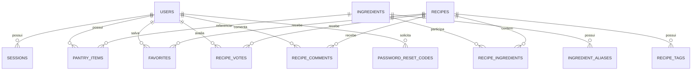

# Modelo de dados atual

A persistência de produção do Receitando usa **Cloudflare D1**. O schema é versionado por migrations SQL em `backend/worker-prototype/migrations/`.

## Visão geral



## Tabelas principais

### `users`

Contas da aplicação. Campos relevantes: `id`, `name`, `email`, `password_hash`, `role`, `handle`, `avatar_key` e timestamps. Senhas nunca são persistidas em texto puro.

### `sessions`

Associa uma sessão a `user_id`, guarda somente `token_hash`, possui expiração e `last_seen_at` e é removida em cascata quando a conta é apagada.

### `ingredients` e `ingredient_aliases`

`ingredients` mantém o catálogo canônico. `ingredient_aliases` aponta variações textuais para o ingrediente correspondente. O matching consulta ambos.

### `recipes`

Dados culinários:

- `id`, `title`, `slug`, `description`, `instructions`;
- `prep_minutes`, `servings`, `meal_type`, `difficulty`;
- timestamps.

Procedência da receita:

- `source_type`, `source_name`, `source_url`;
- `source_author`, `source_license`, `source_license_url`, `source_language`;
- `external_source`, `external_id`, `external_category`, `imported_at`.

Metadados específicos da imagem:

- `image_url`;
- `image_source`;
- `image_author`;
- `image_page_url`;
- `image_license`;
- `image_license_url`;
- `image_alt`.

A procedência da imagem é independente da procedência do texto da receita. O contrato público atual da API expõe esses créditos para que a interface possa cumprir a atribuição exigida pelas fontes externas.

### `recipe_ingredients`

Relação receita/ingrediente, com quantidade, unidade, flag `optional` e `raw_text` quando disponível. O par receita/ingrediente é único.

### `recipe_tags`

Tags associadas às receitas.

### `pantry_items`

Despensa por usuário. Quantidade, unidade e validade são opcionais. O par usuário/ingrediente é único; nova inclusão do mesmo ingrediente atualiza o item existente.

### `favorites`

Relação única entre usuário e receita favorita.

### `recipe_votes`

Um voto por usuário/receita, com valores `LIKE` ou `DISLIKE`.

### `recipe_comments`

Comentários da comunidade ligados a usuário e receita, com timestamps de criação/edição.

### `password_reset_codes`

Estado temporário da recuperação de senha. Persiste hashes do código/token de reset, tentativas, expiração, verificação e uso; os segredos reais não são armazenados em texto puro.

### `auth_rate_limit_events`

Criada em `0014_auth_rate_limits.sql`. Registra eventos temporários usados para limitar abuso de autenticação.

- `action`: tipo de limite, como login por e-mail/IP ou cadastro por IP;
- `key_hash`: SHA-256 do identificador usado no limite, não o e-mail/IP em texto puro;
- `created_at`: instante do evento.

Índices por `(action, key_hash, created_at)` e por `created_at` permitem calcular janelas e remover eventos antigos com eficiência.

## Normalização e matching

A normalização remove acentos, ajusta caixa/espaços e trata separadores conhecidos. Aliases resolvem variações que não podem ser tratadas apenas por normalização textual.

O cálculo principal usa ingredientes obrigatórios:

```text
compatibilidade = ingredientes obrigatórios encontrados
                  ------------------------------------- × 100
                  total de ingredientes obrigatórios
```

## Histórico das migrations

Migrations já aplicadas são **histórico imutável**. Mesmo quando uma estratégia de catálogo é substituída, os arquivos antigos não devem ser renumerados ou reescritos.

### `0008b_prepare_catalog_v3b.sql`

O sufixo `b` é intencional. Essa migration foi adicionada entre `0008_seed_catalog_v3.sql` e `0009_seed_catalog_v3b.sql` como etapa preparatória da expansão v3b.

O catálogo anterior já possuía slugs/IDs que colidiam com duas receitas da expansão. Em vez de substituir registros existentes — o que poderia quebrar URLs, favoritos e comentários já associados — `0008b` cria IDs/slugs alternativos antes da seed seguinte. Assim, os relacionamentos existentes permanecem intactos.

Ela não deve ser renomeada para “corrigir” a sequência: instalações que já aplicaram migrations dependem do nome/histórico atual.

### Procedência e catálogo externo

- `0011_external_catalog.sql`: identidade de fonte externa/deduplicação;
- `0012_recipe_source_attribution.sql`: URL, autor, licença, idioma e data de importação da receita;
- `0013_recipe_image_attribution.sql`: fonte, autor, página, licença e texto alternativo da imagem;
- `0014_auth_rate_limits.sql`: eventos usados pelo rate limiting de autenticação.

A política operacional do catálogo usa Wikilivros/Commons e é aplicada pelo importador atual. Em um D1 novo, aplique todas as migrations e depois execute o importador atual para alinhar o conteúdo à política vigente.

## Execução

Local:

```bash
cd backend/worker-prototype
npm run migrate:local
```

Produção:

```bash
cd backend/worker-prototype
npm run migrate:remote
```

No deploy oficial, migrations remotas são aplicadas somente depois das validações previstas no workflow da API.

## Segurança

O schema e migrations podem ser públicos. O que deve permanecer privado são credenciais, chaves, tokens reais, códigos de recuperação e dados privados dos usuários.

## Documentos relacionados

- [`architecture.md`](architecture.md)
- [`api.md`](api.md)
- [`catalogo.md`](catalogo.md)
- [`deploy.md`](deploy.md)
