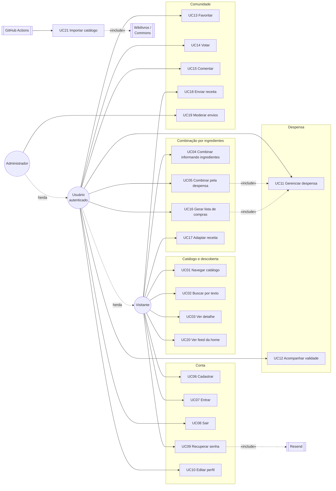

# Receitando — Casos de Uso

Documento de casos de uso levantado a partir do código de `pitado/receitando` (`main`, commit de 09/09/2026).
Referência cruzada: [`receitando-requisitos.md`](receitando-requisitos.md).

Toda regra, limite e código de erro citado aqui foi verificado no código-fonte. Os pontos que não puderam ser determinados estão na seção 6.

---

## 1. Atores

| Ator | Tipo | Descrição |
| --- | --- | --- |
| **Visitante** | primário | Usuário não autenticado. |
| **Usuário autenticado** | primário | Possui sessão válida em `sessions`. Herda o Visitante. |
| **Administrador** | primário | Usuário com `users.role = 'ADMIN'`. Herda o Usuário autenticado. |
| **Serviço de e-mail (Resend)** | secundário | Entrega o código de recuperação de senha. |
| **Wikilivros / Wikimedia Commons** | secundário | Fonte externa de receitas e imagens livres. |
| **GitHub Actions** | secundário | Executa CI, deploys e a importação de catálogo. |
| **Cloudflare D1** | secundário | Persistência relacional. |
| **Cloudflare R2** | secundário | Armazenamento das fotos de receitas enviadas (binding `RECIPE_IMAGES`). |

Generalização: `Administrador` → `Usuário autenticado` → `Visitante`.

---

## 2. Diagrama de casos de uso

---

## 3. Índice dos casos de uso

| ID | Caso de uso | Ator primário | Sessão | Origem |
| --- | --- | --- | --- | --- |
| UC01 | Navegar catálogo de receitas | Visitante | não | `GET /api/recipes` · `/receitas` |
| UC02 | Buscar receita por texto | Visitante | não | `GET /api/recipes?q=` |
| UC03 | Ver detalhe da receita | Visitante | não | `GET /api/recipes/:slug` |
| UC04 | Combinar informando ingredientes | Visitante | não | `POST /api/recipes/match` · `/combinar` |
| UC05 | Combinar pela despensa | Usuário | sim | `GET /api/recipes/match/pantry` |
| UC06 | Cadastrar conta | Visitante | não | `POST /api/auth/register` · `/cadastro` |
| UC07 | Entrar no sistema | Visitante | não | `POST /api/auth/login` · `/entrar` |
| UC08 | Encerrar sessão | Usuário | sim | `POST /api/auth/logout` |
| UC09 | Recuperar senha | Visitante | não | `/recuperar-senha` |
| UC10 | Editar perfil | Usuário | sim | `PATCH /api/auth/me` · `/conta` |
| UC11 | Gerenciar despensa | Usuário | sim | `/api/pantry` · `/despensa` |
| UC12 | Acompanhar validade | Usuário | sim | derivado no frontend |
| UC13 | Gerenciar favoritos | Usuário | sim | `/api/favorites` · `/favoritos` |
| UC14 | Votar na receita | Usuário | sim | `/api/recipes/:id/vote` |
| UC15 | Comentar receita | Usuário | escrita | `/api/recipes/:id/comments` |
| UC16 | Gerar lista de compras | Usuário | sim | derivado no frontend |
| UC17 | Adaptar receita | Visitante/Usuário | condicional | `POST /api/recipes/:slug/adapt` |
| UC18 | Enviar receita | Visitante/Usuário | opcional | `POST /api/recipe-submissions` |
| UC19 | Moderar envios | Administrador | sim + ADMIN | `/api/admin/recipe-submissions` |
| UC20 | Ver feed da home | Visitante | não | `GET /api/home-feed` · `/` |
| UC21 | Importar catálogo | GitHub Actions | — | `scripts/` |

---

## 4. Especificação detalhada

### UC01 — Navegar catálogo de receitas

**Ator:** Visitante · **Pré:** catálogo populado · **Pós:** nenhuma alteração de estado

**Fluxo principal**
1. O usuário acessa `/receitas`.
2. O sistema requisita `GET /api/recipes`.
3. A API aplica `limit` (1 a 60, padrão 36) e `offset`, com filtro opcional por `source`.
4. A interface exibe os cards com título, imagem, tempo de preparo e dificuldade.
5. O usuário pagina os resultados.

**Alternativo A1 — filtros estendidos:** a rota `GET /api/v2/recipes` aceita adicionalmente `mealType`, `difficulty`, `maxPrepMinutes` e `sort` (`relevance`, `recent`, `popular`, `quick`, `title`).

**Exceção E1 — falha da API:** a interface exibe `ErrorState` com opção de nova tentativa.

---

### UC02 — Buscar receita por texto

**Ator:** Visitante · **Pré:** índice FTS5 `recipe_search` populado

**Fluxo principal**
1. O usuário digita o termo no campo de busca do catálogo.
2. O sistema requisita `GET /api/recipes?q={termo}`.
3. A API normaliza o termo e extrai até 8 tokens alfanuméricos distintos.
4. A API monta a consulta FTS5 como conjunção de prefixos (`"token"* AND "token"*`).
5. A API consulta `recipe_search` e ordena por relevância com `bm25()`.
6. A interface exibe os resultados.

**Alternativo A1 — nenhum resultado:** exibe `EmptyState`.

**Regra:** a busca principal não usa `LIKE '%termo%'` sobre a tabela de receitas.

---

### UC03 — Ver detalhe da receita

**Ator:** Visitante · **Pré:** receita existente com o slug informado

**Fluxo principal**
1. O usuário abre `/receitas/{slug}`.
2. O sistema requisita `GET /api/recipes/:slug`.
3. A API retorna conteúdo culinário, ingredientes, tags, procedência da receita e atribuição da imagem.
4. Cada ingrediente pode trazer `isStaple`, quantidade, unidade, forma normalizada e `rawText`.
5. A interface renderiza o conteúdo como texto, nunca como HTML da fonte externa.
6. A interface oferece os acessos a UC13, UC14, UC15, UC16 e UC17.

**Exceção E1 — slug inexistente:** `404` ("Receita não encontrada"); a interface exibe a página 404.

---

### UC04 — Combinar informando ingredientes

**Ator:** Visitante · **Pré:** catálogo e ingredientes canônicos carregados · **Pós:** nenhuma alteração de estado

**Fluxo principal**
1. O usuário digita um ingrediente em `/combinar`.
2. O sistema adiciona o termo como chip.
3. O usuário repete até completar a lista (1 a 40 itens).
4. O usuário aciona a busca.
5. O sistema envia `POST /api/recipes/match`.
6. A API normaliza caixa, acentos e separadores de cada termo.
7. A API gera a forma completa e uma forma canônica conservadora.
8. A API resolve os termos por **igualdade exata** contra `ingredients.normalized_name` e `ingredient_aliases.normalized_alias`, obtendo `ingredient_id`.
9. A API seleciona receitas candidatas.
10. A API remove do denominador os ingredientes opcionais e os `is_staple`.
11. A API calcula o percentual e deriva o status.
12. A API retorna `compatibility`, `status`, `foundIngredients`, `missingIngredients`, `optionalIngredients` e `stapleIngredients`.
13. A interface ordena por compatibilidade e exibe o selo, os encontrados e os faltantes.

**Faixas de status** (verificadas em `lib/recipe-utils.ts`):

| Compatibilidade | Status |
| --- | --- |
| = 100% | `READY` |
| ≥ 70% e < 100% | `ALMOST_READY` |
| ≥ 40% e < 70% | `NEAR` |
| < 40% | `EXPLORE` |

**Alternativo A1 — termo não reconhecido:** o termo não vira `ingredient_id` e não participa do cálculo. Não há inferência por substring: `óleo` não casa com `óleo de gergelim torrado`.

**Alternativo A2 — nenhuma receita compatível:** `EmptyState`.

**Alternativo A3 — usuário autenticado:** a tela oferece "Usar minha despensa" (UC05).

**Exceção E1 — payload inválido:** `400` ("ingredients deve ser uma lista").

**Exceção E2 — lista vazia ou com mais de 40 itens:** `400` ("Informe entre 1 e 40 ingredientes").

---

### UC05 — Combinar pela despensa

**Ator:** Usuário autenticado · **Pré:** sessão válida e despensa não vazia · **Pós:** nenhuma alteração de estado

**Fluxo principal**
1. O usuário aciona "Usar minha despensa" em `/combinar`.
2. O frontend requisita **em paralelo** `GET /api/recipes/match/pantry` e `GET /api/pantry`.
3. A API aplica a mesma regra de compatibilidade do UC04 sobre os ingredientes vinculados ao `user_id`.
4. O frontend cruza os resultados com as validades dos itens.
5. O frontend calcula o score de urgência de cada receita somando os pesos dos ingredientes encontrados.
6. O frontend ordena conforme a regra de desempate.
7. A interface informa que a validade só prioriza resultados próximos.

**Pesos de urgência**

| Situação do ingrediente | Peso |
| --- | ---: |
| vencido ou vence hoje | 5 |
| vence amanhã | 4 |
| vence em 2 a 3 dias | 3 |
| vence em 4 a 7 dias | 1 |
| mais de 7 dias ou sem validade | 0 |

**Regra de ordenação**
1. diferença de compatibilidade maior que 5 pontos → prevalece a compatibilidade;
2. diferença de até 5 pontos → maior score de urgência pode subir;
3. empate remanescente → compatibilidade, menor número de faltantes, menor tempo de preparo, título.

**Exceção E1 — sem sessão:** `401` ("Entre na sua conta para usar sua despensa").

**Exceção E2 — despensa vazia:** estado vazio orientando o cadastro de itens.

---

### UC06 — Cadastrar conta

**Ator:** Visitante · **Pós:** registro em `users` e sessão criada em `sessions`

**Fluxo principal**
1. O usuário preenche nome, e-mail e senha em `/cadastro` e opcionalmente marca "Lembrar de mim".
2. O sistema envia `POST /api/auth/register`.
3. O entrypoint verifica o limite de cadastros por IP.
4. A API valida nome (2 a 100 caracteres), e-mail (formato válido, até 254 caracteres) e senha (10 a 128 caracteres).
5. A API verifica se o e-mail já existe.
6. A API deriva o hash da senha com PBKDF2.
7. A API grava o usuário com `role = 'USER'`.
8. A API cria a sessão, grava apenas o hash SHA-256 do token e devolve `201` com o cookie de sessão.

**Exceção E1 — nome inválido:** `400` ("Informe um nome válido").
**Exceção E2 — e-mail inválido:** `400` ("Informe um e-mail válido").
**Exceção E3 — senha fora da faixa:** `400` ("A senha deve ter entre 10 e 128 caracteres").
**Exceção E4 — e-mail já cadastrado:** `409` ("Já existe uma conta com este e-mail").
**Exceção E5 — limite de cadastros por IP:** `429` com `Retry-After` (5 por hora).

---

### UC07 — Entrar no sistema

**Ator:** Visitante · **Pós:** nova sessão criada

**Fluxo principal**
1. O usuário informa e-mail e senha em `/entrar` e opcionalmente marca "Lembrar de mim".
2. O sistema envia `POST /api/auth/login`.
3. O entrypoint verifica os limites por e-mail e por IP.
4. A API busca o usuário e verifica a senha.
5. A API cria a sessão com validade de 30 dias em `sessions`.
6. A API responde com o cookie de sessão.

**Regra do "Lembrar de mim":** com a opção marcada, o cookie recebe `Max-Age` de 30 dias e sobrevive ao fechamento do navegador. Sem ela, o cookie é de sessão do navegador — mas o registro em `sessions` continua com validade de 30 dias.

**Exceção E1 — campos ausentes:** `400` ("Informe e-mail e senha").
**Exceção E2 — credenciais inválidas:** `401` ("E-mail ou senha inválidos"), mensagem idêntica para e-mail inexistente e senha errada.
**Exceção E3 — limite atingido:** `429` com `Retry-After` (5 falhas por e-mail ou 20 por IP em 15 minutos).

---

### UC08 — Encerrar sessão

**Ator:** Usuário autenticado · **Pós:** registro removido de `sessions` e cookie expirado

**Fluxo principal**
1. O usuário aciona a saída no cabeçalho.
2. O sistema envia `POST /api/auth/logout`.
3. A API remove de `sessions` a linha cujo `token_hash` corresponde ao token apresentado.
4. A resposta expira o cookie no navegador.

**Alternativo A1 — sem token apresentado:** a API responde vazio mesmo assim, sem erro.

---

### UC09 — Recuperar senha

**Ator:** Visitante · **Ator secundário:** Resend · **Pós:** senha alterada e todas as sessões do usuário invalidadas

**Fluxo principal**
1. O usuário informa o e-mail em `/recuperar-senha`.
2. O sistema envia `POST /api/auth/forgot-password`.
3. O entrypoint verifica os limites por e-mail e por IP.
4. Existindo a conta, a API gera um código de 6 dígitos, persiste apenas a forma derivada em `password_reset_codes` e solicita o envio ao Resend.
5. A API responde com mensagem genérica para qualquer e-mail sintaticamente válido.
6. O usuário informa o código recebido.
7. O sistema envia `POST /api/auth/verify-reset-code`.
8. Validado o código, a API devolve um token temporário armazenado apenas como hash.
9. O usuário define a nova senha.
10. O sistema envia `POST /api/auth/reset-password`.
11. A API grava o novo hash e apaga as sessões do usuário.

**Parâmetros verificados**

| Parâmetro | Valor |
| --- | --- |
| validade do código | 10 minutos |
| cooldown de reenvio | 60 segundos |
| tentativas por código | 5 |
| solicitações por e-mail | 3 a cada 15 minutos |
| solicitações por IP | 10 a cada 15 minutos |

**Exceção E1 — código incorreto, expirado ou acima do limite de tentativas:** rejeição sem revelar qual condição ocorreu.
**Exceção E2 — reenvio dentro do cooldown:** bloqueado, mantendo a resposta genérica.
**Exceção E3 — limite de solicitações:** `429` com `Retry-After`.

---

### UC10 — Editar perfil

**Ator:** Usuário autenticado · **Pós:** `users.name`, `users.handle` e `users.avatar_key` atualizados

**Fluxo principal**
1. O usuário acessa `/conta`.
2. O sistema requisita `GET /api/auth/me`.
3. O usuário altera nome, identificador `@` e/ou avatar.
4. O sistema envia `PATCH /api/auth/me`.
5. A API valida cada campo e persiste.

**Regras de validação**

| Campo | Regra |
| --- | --- |
| nome | 2 a 100 caracteres |
| handle | `^[a-z0-9][a-z0-9_]{2,23}$` — 3 a 24 caracteres, começa com letra ou número, aceita `_` |
| handle reservado | `admin`, `api`, `receitando`, `suporte`, `contato` |
| handle | único entre os usuários (índice parcial) |
| avatar | um de: `tomato`, `lemon`, `egg`, `carrot`, `strawberry`, `bread`, `avocado`, `mushroom` |

**Exceção E1 — handle fora do padrão, reservado ou já em uso:** rejeição com mensagem correspondente.
**Exceção E2 — sem sessão:** `401`.

---

### UC11 — Gerenciar despensa

**Ator:** Usuário autenticado · **Pós:** `pantry_items` atualizada para o `user_id` da sessão

**Fluxo principal — listar**
1. O usuário acessa `/despensa`.
2. O sistema requisita `GET /api/pantry`.
3. A API ordena os itens com validade primeiro, da data mais próxima para a mais distante, e depois os sem validade, desempatando por nome do ingrediente.

**Fluxo principal — adicionar ou atualizar**
1. O usuário seleciona um ingrediente do catálogo canônico.
2. O usuário informa opcionalmente quantidade, unidade (até 40 caracteres) e validade (`YYYY-MM-DD`).
3. O sistema envia `POST /api/pantry`.
4. A API valida o `ingredientId` contra `ingredients`.
5. Existindo item do mesmo ingrediente para aquele usuário, a API atualiza o registro; caso contrário, cria.

**Fluxo alternativo — remover**
1. O usuário aciona a remoção.
2. O sistema envia `DELETE /api/pantry/:itemId`.
3. A API remove apenas se o item pertencer ao usuário autenticado.

**Semântica de `expiresAt`**

| Valor enviado | Comportamento |
| --- | --- |
| data válida | grava ou atualiza a validade |
| `null` ou string vazia | remove a validade |
| campo omitido em item existente | preserva a validade atual |
| formato inválido | `400` ("Informe uma data de validade válida") |

**Exceção E1 — sem sessão:** `401` ("Entre na sua conta para acessar a despensa").
**Exceção E2 — `ingredientId` ausente:** `400` ("Selecione um ingrediente").
**Exceção E3 — ingrediente inexistente:** `404` ("Ingrediente não encontrado").
**Exceção E4 — método não suportado:** `405`.

---

### UC12 — Acompanhar validade dos itens

**Ator:** Usuário autenticado · **Pré:** despensa com itens que possuam validade · **Pós:** nenhuma alteração de estado

**Fluxo principal**
1. O usuário acessa `/despensa`.
2. O frontend calcula a diferença entre cada `expiresAt` e a data corrente.
3. A interface exibe mensagens relativas: `Vence hoje`, `Vence amanhã`, `Vence em N dias`.
4. A interface destaca itens vencidos ou próximos do vencimento.
5. Havendo itens vencidos ou com até 3 dias para vencer, a interface exibe um alerta da despensa.

**Limitação registrada:** o aviso é exclusivamente in-app. Não existe Web Push, e-mail automático ou qualquer notificação em segundo plano.

---

### UC13 — Gerenciar favoritos

**Ator:** Usuário autenticado · **Pós:** `favorites` atualizada

**Fluxo principal**
1. O usuário aciona o botão de favorito no card ou no detalhe da receita.
2. O sistema envia `POST /api/favorites` com o identificador da receita.
3. A API valida a existência da receita e grava o vínculo com o `user_id`.
4. A página `/favoritos` lista os favoritos via `GET /api/favorites`.

**Alternativo A1 — desfavoritar:** `DELETE /api/favorites/:recipeId`.

**Exceção E1 — sem sessão:** `401` ("Entre na sua conta para acessar favoritos").
**Exceção E2 — receita não informada:** `400` ("Informe a receita").
**Exceção E3 — receita inexistente:** `404` ("Receita não encontrada").

---

### UC14 — Votar na receita

**Ator:** Usuário autenticado · **Pós:** `recipe_votes` atualizada

**Fluxo principal**
1. O usuário aciona "gostei" ou "não gostei" no detalhe da receita.
2. O sistema envia `PUT /api/recipes/:recipeId/vote` com `LIKE` ou `DISLIKE`.
3. A API registra ou substitui o voto do usuário para aquela receita.
4. A interface atualiza o resumo obtido em `GET /api/recipes/:recipeId/social`, que traz totais de likes, dislikes e o voto do próprio usuário.

**Alternativo A1 — remover voto:** `DELETE /api/recipes/:recipeId/vote`.

**Exceção E1 — valor diferente de `LIKE` ou `DISLIKE`:** `400`.
**Exceção E2 — sem sessão:** `401`.

---

### UC15 — Comentar receita

**Ator:** Usuário autenticado para escrita; leitura pública · **Pós:** `recipe_comments` atualizada

**Fluxo principal**
1. Qualquer visitante lê os comentários via `GET /api/recipes/:recipeId/comments`.
2. O usuário autenticado escreve um comentário de 2 a 1200 caracteres.
3. O sistema envia `POST /api/recipes/:recipeId/comments`.
4. A API valida o tamanho e grava o comentário vinculado ao autor.

**Alternativo A1 — editar:** `PATCH /api/recipe-comments/:commentId`, com a mesma validação de tamanho.
**Alternativo A2 — excluir:** `DELETE /api/recipe-comments/:commentId`.

**Regra:** editar e excluir validam que o solicitante é o autor do registro antes da mutação.

**Exceção E1 — texto fora da faixa de 2 a 1200 caracteres:** `400`.
**Exceção E2 — sem sessão na escrita:** `401`.
**Exceção E3 — solicitante não é o autor:** operação negada.

---

### UC16 — Gerar lista de compras

**Ator:** Usuário autenticado · **Pré:** sessão válida e receita aberta · **Pós:** nenhuma alteração de estado

**Fluxo principal**
1. No detalhe da receita, o usuário aciona a comparação com a despensa.
2. O frontend requisita `GET /api/pantry`.
3. O frontend cruza os `ingredientId` canônicos da receita com os itens da despensa.
4. O frontend monta a lista apenas com ingredientes obrigatórios ausentes.
5. O usuário copia a lista.

**Exclusões da lista principal:** ingredientes já presentes, opcionais e básicos (`is_staple`).

**Limitação registrada:** a comparação é de presença e ausência. A lista não calcula compra parcial por quantidade.

**Observação de projeto:** não existe rota dedicada de lista de compras; o cálculo vive no frontend.

---

### UC17 — Adaptar receita

**Ator:** Visitante ou Usuário autenticado · **Pré:** receita existente; sessão obrigatória apenas com `usePantry = true` · **Pós:** nenhuma alteração de estado

**Fluxo principal**
1. No detalhe da receita, o usuário abre o adaptador.
2. O usuário informa `targetServings` e/ou marca ingredientes indisponíveis.
3. O usuário autenticado pode ativar `usePantry`.
4. O sistema envia `POST /api/recipes/:slug/adapt`.
5. O motor carrega a receita, os ingredientes e as tags.
6. O motor recalcula quantidades quando há rendimento original utilizável.
7. O motor incorpora as faltas marcadas manualmente.
8. Com `usePantry`, o motor cruza a despensa e compara quantidades apenas quando as unidades são seguramente comparáveis.
9. O motor infere sinais do contexto culinário: assado, frito, cozido, fresco, doce/salgado e papel estrutural do ingrediente.
10. O motor aplica substituições conhecidas compatíveis com esse contexto.
11. A resposta traz mudanças, avisos, nível de confiança, justificativa, alternativas e o objeto `pantry` com `used`, `presentCount`, `missingCount`, `shortageCount`, `missingIngredientIds` e `shortages`.

**Alternativo A1 — sem substituição confiável:** a interface declara a limitação em vez de propor equivalência.
**Alternativo A2 — unidades incompatíveis:** o motor não infere densidade para converter massa em volume e não compara.
**Alternativo A3 — sem rendimento original utilizável:** as quantidades não são reescaladas.

**Exceção E1 — `targetServings` fora da faixa:** `400` ("targetServings deve ser um inteiro entre 1 e 50").
**Exceção E2 — `usePantry = true` sem sessão:** `401`.

---

### UC18 — Enviar receita para o catálogo

**Ator:** Visitante ou Usuário autenticado · **Pós:** registro em `recipe_submissions` com `status = 'PENDING'` e objeto gravado no R2

**Fluxo principal**
1. O usuário acessa `/enviar-receita` e preenche o formulário.
2. O usuário anexa a foto do prato.
3. O sistema envia `POST /api/recipe-submissions`.
4. A API verifica o campo honeypot `website`.
5. A API valida os campos.
6. A API detecta o tipo real da imagem pelo conteúdo do arquivo.
7. A API grava o objeto em `submissions/AAAA/MM/{id}.{ext}` no bucket `RECIPE_IMAGES`.
8. A API insere a submissão com `status = 'PENDING'`, vinculando o `user_id` quando há sessão.
9. A interface confirma que a receita foi recebida para análise.

**Validações**

| Campo | Regra |
| --- | --- |
| `authorName` | mínimo 2 caracteres |
| `authorEmail` | e-mail válido ou vazio |
| `title` | mínimo 3 caracteres |
| `description` | mínimo 10 caracteres |
| `ingredients` | 2 a 50 linhas, até 180 caracteres cada |
| `instructions` | 1 a 30 passos, até 500 caracteres cada |
| foto | obrigatória, JPG/PNG/WebP, até 12 MB |

**Alternativo A1 — honeypot preenchido:** a API responde `201` com mensagem idêntica à do sucesso, sem persistir nada.

**Exceção E1 — corpo inválido:** `400` ("Dados inválidos").
**Exceção E2 — validação de campo:** `400` com a mensagem específica do campo.
**Exceção E3 — foto acima de 12 MB:** `413`.
**Exceção E4 — formato de imagem inválido:** `400`.
**Exceção E5 — bucket indisponível:** `503`.
**Exceção E6 — falha de persistência:** `500`.

---

### UC19 — Moderar receitas enviadas

**Ator:** Administrador · **Pré:** sessão válida de usuário com `role = 'ADMIN'` · **Pós:** submissão com `status`, `reviewed_by` e `reviewed_at` preenchidos

**Fluxo principal**
1. O administrador acessa `/admin/receitas`.
2. O sistema requisita `GET /api/admin/recipe-submissions?status=PENDING`.
3. A API confirma o papel `ADMIN` antes de qualquer leitura.
4. A API retorna até 200 registros, ordenados por `created_at` decrescente.
5. O administrador analisa e decide.
6. O sistema envia `PATCH /api/admin/recipe-submissions/:id` com `APPROVED` ou `REJECTED`.
7. Em `APPROVED`, a API publica a receita no catálogo, grava `status = 'APPROVED'` e preenche `published_recipe_id`, `reviewed_by` e `reviewed_at`.
8. Em `REJECTED`, a API grava `status = 'REJECTED'`, a justificativa, o revisor e a data.

**Filtros aceitos:** `PENDING` (padrão), `APPROVED`, `REJECTED`, `ALL`. Valor desconhecido cai no padrão.

**Exceção E1 — usuário sem papel ADMIN:** `403` ("Acesso restrito a administradores").
**Exceção E2 — identificador inválido:** `400`.
**Exceção E3 — submissão inexistente:** `404`.
**Exceção E4 — submissão já analisada:** `409` ("Essa submissão já foi analisada").
**Exceção E5 — submissão sem conteúdo suficiente para publicação:** `409`.
**Exceção E6 — decisão diferente de `APPROVED`/`REJECTED`:** `400`.
**Exceção E7 — método não permitido na rota:** `405`.

---

### UC20 — Ver feed da página inicial

**Ator:** Visitante · **Pós:** nenhuma alteração de estado

**Fluxo principal**
1. O usuário acessa `/`.
2. O sistema requisita `GET /api/home-feed`.
3. A API consolida receitas populares, comentários recentes e totais.
4. A interface exibe o conteúdo e os acessos às áreas principais.

---

### UC21 — Importar catálogo de fonte aberta

**Ator:** GitHub Actions (workflow `import-wikibooks.yml`) · **Atores secundários:** Wikilivros, Wikimedia Commons, D1, R2

**Fluxo principal**
1. Consulta o Wikilivros em português e descobre páginas candidatas.
2. Interpreta ingredientes e modo de preparo como texto.
3. Procura imagem correspondente no Wikimedia Commons.
4. Valida relevância e licença.
5. Registra a procedência da receita e a atribuição da imagem.
6. Grava as receitas em lotes no D1.
7. Canonicaliza variações de ingredientes preservando aliases.
8. Marca ingredientes básicos (`is_staple`) e otimiza o banco.
9. Espelha as imagens para o R2.

**Scripts:** `import-wikibooks-v2.mjs`, `canonicalize-ingredients.mjs`, `mirror-wikibooks-images-to-r2.mjs`.

**Observação:** a execução é manual, disparada pelo workflow, e independente do deploy da aplicação.

---

## 5. Matriz caso de uso × requisito

Referência para [`receitando-requisitos.md`](receitando-requisitos.md).

| Caso de uso | Requisitos funcionais | Regras de negócio |
| --- | --- | --- |
| UC01 | RF01, RF14, RF18 | RN18 |
| UC02 | RF17 | RN20 |
| UC03 | RF02, RF14 | RN18, RN21 |
| UC04 | RF03, RF04, RF05, RF15, RF16 | RN01, RN02, RN03, RN04, RN22 |
| UC05 | RF04, RF05, RF09, RF21 | RN02, RN04, RN05, RN06 |
| UC06 | RF06, RF30 | RN19, RN23, RN24 |
| UC07 | RF06, RF30 | RN23, RN24, RN25 |
| UC08 | RF06 | RN23 |
| UC09 | RF07, RF30 | RN09, RN10, RN11 |
| UC10 | RF28 | RN26 |
| UC11 | RF08, RF19 | RN07, RN08 |
| UC12 | RF20 | RN27 |
| UC13 | RF10 | RN08 |
| UC14 | RF11 | RN28 |
| UC15 | RF12 | RN14, RN29 |
| UC16 | RF22 | RN02, RN04 |
| UC17 | RF23, RF24 | RN12, RN13 |
| UC18 | RF25 | RN15, RN16, RN30 |
| UC19 | RF26, RF27 | RN15, RN17, RN31 |
| UC20 | RF29 | — |
| UC21 | RF13 | RN18, RN21 |

---

## 6. Pontos em aberto

Estes casos de uso descrevem **o comportamento implementado**. As lacunas abaixo não são erros do documento; são decisões que o projeto ainda não tomou e que nenhuma leitura do código pode suprir. A lista completa, com o impacto de cada uma, está na seção 6 de [`receitando-requisitos.md`](receitando-requisitos.md).

1. Não existe caso de uso de concessão do papel `ADMIN`. A coluna `users.role` nasce como `USER` e não há rota, seed ou script que promova alguém.
2. Não existe caso de uso de exclusão de conta nem de exportação de dados pessoais.
3. Não existe caso de uso de denúncia ou moderação de comentários — só o autor pode remover o próprio texto.
4. O autor de uma submissão não é notificado da aprovação ou rejeição. O campo `authorEmail` é coletado, mas nenhum envio ocorre nesse fluxo.
5. Não há caso de uso de administração do catálogo publicado: receitas aprovadas ou importadas não podem ser editadas nem despublicadas pela aplicação.
